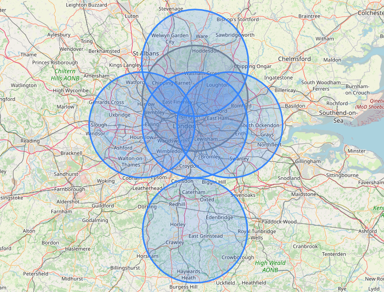

# Geofences Reducer
> Reduces overlapping geofences.

[![Build Status][ci-image]][ci-url]
[![License][license-image]][license-url]
[![Developed at Klarna][klarna-image]][klarna-url]


Given a list of circular geofences, this library removes the overlapping items and returns a reduced list that could be used to represent the same area.

## Usage example

### Installation

Via npm:

```sh
npm install --save https://github.com/klarna-incubator/geofences-reducer
```

Via yarn:

```sh
yarn add https://github.com/klarna-incubator/geofences-reducer
```

### Usage

With JavaScript:

```javascript
const reducer = require('@klarna/geofences-reducer')

const geofences = [
  {
    latitude: 51.51,
    longitude: -0.36,
    radius: 20000 // in meters
  },
  {
    latitude: 51.51,
    longitude: -0.07,
    radius: 20000 // in meters
  },
  {
    latitude: 51.6,
    longitude: -0.07,
    radius: 20000 // in meters
  },
  {
    latitude: 51.51,
    longitude: 0.12,
    radius: 20000 // in meters
  },
  {
    latitude: 51.15,
    longitude: -0.07,
    radius: 20000 // in meters
  },
  {
    latitude: 51.72,
    longitude: -0.07,
    radius: 20000 // in meters
  }
]

const geofencesReduced = reducer.reduce(geofences)
```

With TypeScript:

```typescript
import * as reducer from '@klarna/geofences-reducer'

type Geofence = {
  latitude: number
  longitude: number
  radius: number
}

const geofences: Geofence[] = [
  {
    latitude: 51.51,
    longitude: -0.36,
    radius: 20000 // in meters
  },
  {
    latitude: 51.51,
    longitude: -0.07,
    radius: 20000 // in meters
  },
  {
    latitude: 51.6,
    longitude: -0.07,
    radius: 20000 // in meters
  },
  {
    latitude: 51.51,
    longitude: 0.12,
    radius: 20000 // in meters
  },
  {
    latitude: 51.15,
    longitude: -0.07,
    radius: 20000 // in meters
  },
  {
    latitude: 51.72,
    longitude: -0.07,
    radius: 20000 // in meters
  }
]

const geofencesReduced: Geofence[] = reducer.reduce(geofences)
```

Result:



### Optional Configuration

#### Precision

Precision can be customized as follows:

```javascript
const config = {
  precision: 5 // 6 by default, accepts 1 to 12
}

const geofencesReduced = reducer.reduce(geofences, config)
```

## Development setup

Install project dependencies:

```sh
npm install
```

Run automated test-suite:

```sh
npm test
```

## How to contribute

See our guide on [contributing](.github/CONTRIBUTING.md).

## Release History

See our [changelog](CHANGELOG.md).

## License

Copyright © 2021 Klarna Bank AB

For license details, see the [LICENSE](LICENSE) file in the root of this project.


<!-- Markdown link & img dfn's -->
[ci-image]: https://img.shields.io/badge/build-passing-brightgreen?style=flat-square
[ci-url]: https://github.com/klarna-incubator/geofences-reducer/actions
[license-image]: https://img.shields.io/badge/license-Apache%202-blue?style=flat-square
[license-url]: http://www.apache.org/licenses/LICENSE-2.0
[klarna-image]: https://img.shields.io/badge/%20-Developed%20at%20Klarna-black?labelColor=ffb3c7&style=flat-square&logo=data:image/png;base64,iVBORw0KGgoAAAANSUhEUgAAABAAAAAOCAYAAAAmL5yKAAAAAXNSR0IArs4c6QAAAIRlWElmTU0AKgAAAAgABQESAAMAAAABAAEAAAEaAAUAAAABAAAASgEbAAUAAAABAAAAUgEoAAMAAAABAAIAAIdpAAQAAAABAAAAWgAAAAAAAALQAAAAAQAAAtAAAAABAAOgAQADAAAAAQABAACgAgAEAAAAAQAAABCgAwAEAAAAAQAAAA4AAAAA0LMKiwAAAAlwSFlzAABuugAAbroB1t6xFwAAAVlpVFh0WE1MOmNvbS5hZG9iZS54bXAAAAAAADx4OnhtcG1ldGEgeG1sbnM6eD0iYWRvYmU6bnM6bWV0YS8iIHg6eG1wdGs9IlhNUCBDb3JlIDUuNC4wIj4KICAgPHJkZjpSREYgeG1sbnM6cmRmPSJodHRwOi8vd3d3LnczLm9yZy8xOTk5LzAyLzIyLXJkZi1zeW50YXgtbnMjIj4KICAgICAgPHJkZjpEZXNjcmlwdGlvbiByZGY6YWJvdXQ9IiIKICAgICAgICAgICAgeG1sbnM6dGlmZj0iaHR0cDovL25zLmFkb2JlLmNvbS90aWZmLzEuMC8iPgogICAgICAgICA8dGlmZjpPcmllbnRhdGlvbj4xPC90aWZmOk9yaWVudGF0aW9uPgogICAgICA8L3JkZjpEZXNjcmlwdGlvbj4KICAgPC9yZGY6UkRGPgo8L3g6eG1wbWV0YT4KTMInWQAAAVBJREFUKBVtkz0vREEUhsdXgo5qJXohkUgQ0fgFNFpR2V5ClP6CQu9PiB6lEL1I7B9A4/treZ47c252s97k2ffMmZkz5869m1JKL/AFbzAHaiRbmsIf4BdaMAZqMFsOXNxXkroKbxCPV5l8yHOJLVipn9/vEreLa7FguSN3S2ynA/ATeQuI8tTY6OOY34DQaQnq9mPCDtxoBwuRxPfAvPMWnARlB12KAi6eLTPruOOP4gcl33O6+Sjgc83DJkRH+h2MgorLzaPy68W48BG2S+xYnmAa1L+nOxEduMH3fgjGFvZeVkANZau68B6CrgJxWosFFpF7iG+h5wKZqwt42qIJtARu/ix+gqsosEq8D35o6R3c7OL4lAnTDljEe9B3Qa2BYzmHemDCt6Diwo6JY7E+A82OnN9HuoBruAQvUQ1nSxP4GVzBDRyBfygf6RW2/gD3NmEv+K/DZgAAAABJRU5ErkJggg==
[klarna-url]: https://klarna.github.io
